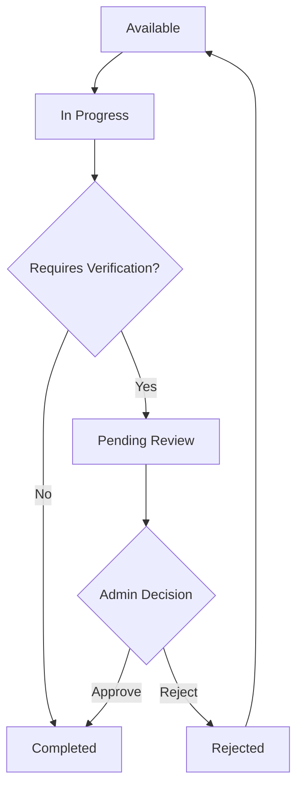

# Daily Task System Documentation

## Overview

The Daily Task System in MyFigPoint allows administrators to create tasks that users can complete to earn rewards. Some tasks require admin verification before rewards are awarded.

## How It Works

### 1. Task Creation
- Admin creates a daily task through the admin panel
- Tasks can be configured to require admin verification
- Example: "Upload 5 codes today to earn an extra $1 reward"

### 2. User Joins the Task
- User navigates to the "Earn Points" section
- User sees available tasks
- User clicks "Join Task" to begin working on a task

### 3. User Completes the Task
- After fulfilling the task requirements, user returns to the task page
- User clicks "Task Completed" to submit for review

### 4. Admin Verification
- If the task requires admin verification, it appears in the "Task Review" section of the admin panel
- Admin reviews the user's work (e.g., checks code upload history)
- Admin either approves or rejects the task completion

### 5. Reward & Confirmation
- Upon approval, the system automatically awards points/money to the user
- User receives a notification confirming the reward
- Transaction is recorded in the user's history

## Technical Implementation

### Backend Components

#### Models
- `Task` model with `requires_admin_verification` field
- `UserTask` model with `pending_review` and `rejected` statuses

#### API Endpoints

##### User Endpoints
- `GET /api/tasks/` - List available tasks
- `POST /api/tasks/{task_id}/start` - Start working on a task
- `POST /api/tasks/{task_id}/complete` - Submit task for completion

##### Admin Endpoints
- `POST /api/tasks/admin` - Create new task
- `PUT /api/tasks/admin/{task_id}` - Update existing task
- `GET /api/tasks/admin/completed-tasks` - List tasks pending review
- `POST /api/tasks/admin/{task_id}/complete` - Approve and reward task completion
- `POST /api/tasks/admin/{user_task_id}/reject` - Reject task completion

### Frontend Components

#### User Interface
- `tasks.html` - Task listing and interaction
- `dashboard.html` - Notification display for task status updates

#### Admin Interface
- `admin-tasks.html` - Task review panel

## Status Flow

## Example Workflow

1. Admin creates a task: "Upload 5 codes today" with admin verification required
2. User joins the task and uploads 5 codes
3. User marks task as completed
4. Task appears in admin review queue
5. Admin verifies the code uploads
6. Admin approves the task
7. User receives $1 and 50 points
8. User gets notification of successful completion

## Notifications

The system sends automatic notifications for:
- Task submission for review
- Task approval with rewards
- Task rejection with reason

Users can see these notifications in their dashboard.